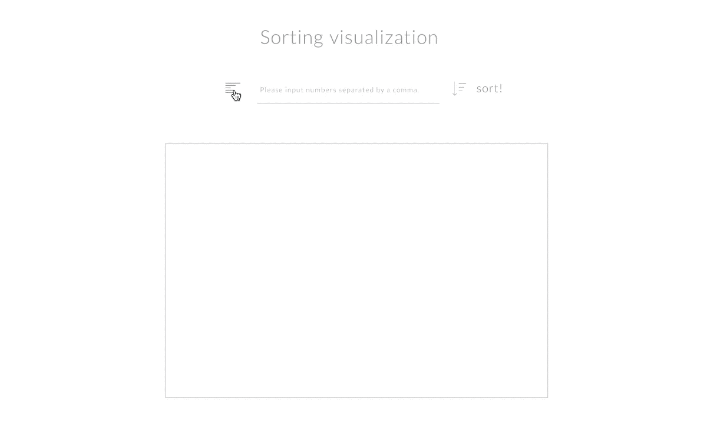
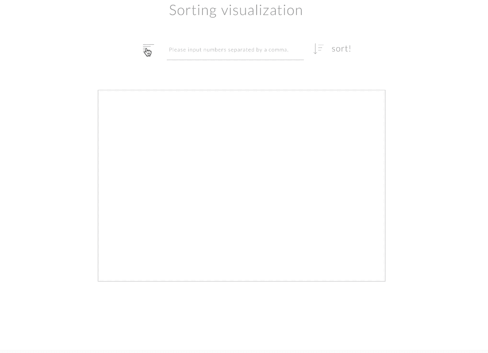
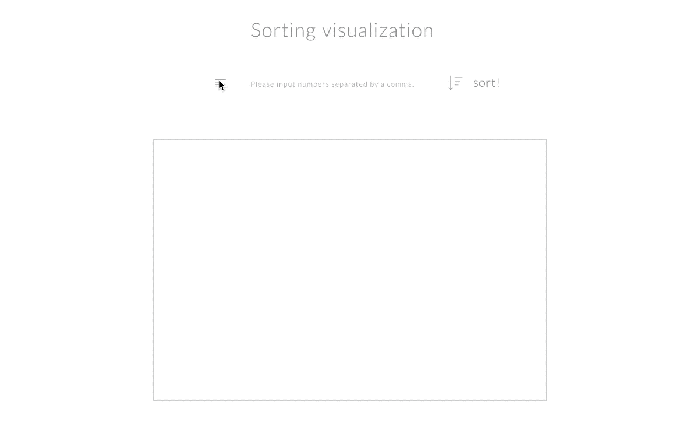
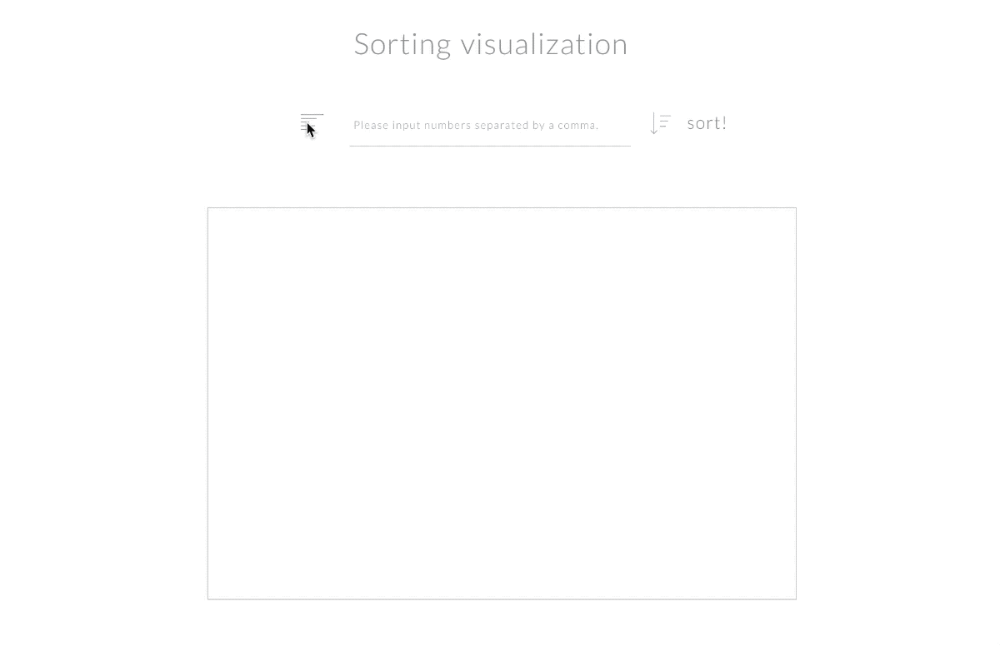

# Vanilla Sorting Visualization

정렬 알고리즘의 구동 방식을 HTML5, CSS3, 순수 자바스크립트를 이용해 웹으로 시각화한 애플리케이션입니다.

### Setup

Install dependencies

```sh
$ yarn install (or npm install)
```

### Development

```sh
$ yarn dev (or npm run dev)
# visit http://localhost:8080
```

### FEATURE

4가지 정렬 알고리즘의 구동 방식을 시각적으로 표현했습니다.

* 사용자가 "숫자"를 최소 5개에서 최대 10개까지 선택할 수 있습니다.
* 숫자를 입력 후, 사용자는 원하는 정렬 방식을 선택 및 실행시킬 수 있습니다.
* 시각적으로 해당 정렬 로직이 어떤 식으로 작동되는지 확인할 수 있습니다.

### 정렬 알고리즘 종류

아래 4가지의 정렬 방식이 모두 구현했으며, 아래와 같이 사각화한 정렬 알고리즘을 확인할 수 있습니다.

1. Bubble Sort
버블정렬은 데이터의 인접한 두 요소를 비교하며, 정렬 기준에 맞지 않으면 두 요소의 위치를 서로 변경하는 정렬방법입니다. 비교적 간단한 정렬 알고리즘이지만 그에 따라 시간복잡도가 O(n^2)이기에 실용적이지는 않습니다.

버블정렬의 숫자 정렬 방식은 아래와 같습니다.
\- list를 loop합니다.
\- 인접한 두 요소를 비교합니다.
\- 큰 수를 뒤쪽에 위치하도록 두 요소의 자리를 변경합니다.
\- 위 방법을 배열의 길이만큼 반복합니다.

장점
Bubble-sort는 "in-place"로, 공간복잡도가 좋습니다.
쓰고 이해하기 쉽습니다.

단점
성능이 좋지 않습니다. 특히 데이터의 양이 크면 더더욱 좋지 않습니다. 따라서, 거의 학습용으로 사용하는 정렬 알고리즘이라고 간주할 수 있습니다.

2. Insertion Sort

3. Merge Sort

4. Selection Sort

